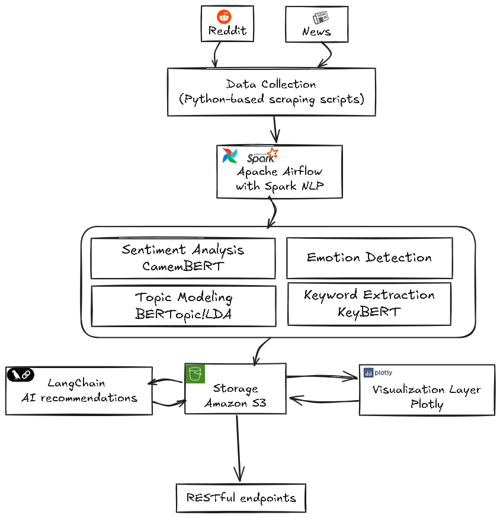

# RepuSense: Projet de Suivi Automatisé de la Réputation Numérique

## Équipe du Projet
- **Mouad Ennasiry**
- **Kamal Saalaoui**
- **Hicham Ennami**

## Table des Matières

1. [Introduction](#1-introduction)
   - [Contexte du projet](#contexte-du-projet)
   - [Objectifs de la digitalisation](#objectifs-de-la-digitalisation)
   - [Présentation de l'entreprise](#présentation-de-lentreprise)

2. [Problématique identifiée](#2-problématique-identifiée)
   - [Défis liés à la gestion de la réputation d'entreprise](#défis-liés-à-la-gestion-de-la-réputation-dentreprise)
   - [Limites des approches traditionnelles](#limites-des-approches-traditionnelles)
   - [Opportunités offertes par la digitalisation](#opportunités-offertes-par-la-digitalisation)

3. [Présentation de la solution RepuSense](#3-présentation-de-la-solution-repusense)
   - [Objectifs fonctionnels et techniques](#objectifs-fonctionnels-et-techniques)
   - [Vue d'ensemble de l'architecture](#vue-densemble-de-larchitecture)
   - [Sources de données exploitées](#sources-de-données-exploitées)

4. [Axes de digitalisation ciblés](#4-axes-de-digitalisation-ciblés)
   - [Automatisation de la veille réputationnelle](#automatisation-de-la-veille-réputationnelle)
   - [Analyse sémantique via NLP](#analyse-sémantique-via-nlp)
   - [Visualisation des indicateurs clés](#visualisation-des-indicateurs-clés)

5. [Stratégie de mise en œuvre](#5-stratégie-de-mise-en-œuvre)
   - [Choix technologiques](#choix-technologiques)
   - [Méthodologie de développement](#méthodologie-de-développement)
   - [Gestion des données et respect de la confidentialité](#gestion-des-données-et-respect-de-la-confidentialité)

6. [Déploiement technique](#6-déploiement-technique)
   - [Structure du pipeline](#structure-du-pipeline)
   - [Organisation du traitement](#organisation-du-traitement)
   - [Stockage et intégration des résultats](#stockage-et-intégration-des-résultats)

7. [Résultats et démonstration](#7-résultats-et-démonstration)
   - [Exemples d'analyses de sentiment](#exemples-danalyses-de-sentiment)
   - [Thèmes identifiés par topic modeling](#thèmes-identifiés-par-topic-modeling)
   - [Distribution des sources](#distribution-des-sources)
   - [Analyse des tendances](#analyse-des-tendances)
   - [Interface du dashboard](#interface-du-dashboard)
   - [Résumé des problématiques détectées](#résumé-des-problématiques-détectées)

8. [Limites et perspectives](#8-limites-et-perspectives)
   - [Contraintes techniques rencontrées](#contraintes-techniques-rencontrées)
   - [Améliorations envisagées](#améliorations-envisagées)
   - [Scalabilité et adaptation à d'autres secteurs](#scalabilité-et-adaptation-à-dautres-secteurs)

9. [Conclusion](#9-conclusion)
   - [Bilan de la digitalisation apportée](#bilan-de-la-digitalisation-apportée)
   - [Apports pour l'entreprise et les parties prenantes](#apports-pour-lentreprise-et-les-parties-prenantes)

10. [Annexes](#10-annexes)
    - [Schéma d'architecture du pipeline](#schéma-darchitecture-du-pipeline)
    - [Structure du projet](#structure-du-projet)
    - [Principales bibliothèques utilisées](#principales-bibliothèques-utilisées)
    - [Références bibliographiques et techniques](#références-bibliographiques-et-techniques)

## 1. Introduction

### Contexte du projet

À l'ère du numérique, l'e-réputation est devenue un actif stratégique fondamental pour toute organisation. Selon une étude récente de McKinsey (2023), 85% des consommateurs consultent les avis en ligne avant d'effectuer un achat, et 78% des dirigeants d'entreprise considèrent que leur réputation numérique influence directement leurs résultats financiers. Les commentaires, évaluations et discussions sur les plateformes digitales façonnent non seulement la perception publique d'une marque, mais influencent également de manière significative les décisions des consommateurs, des investisseurs et des partenaires potentiels.

Cette omniprésence de l'information numérique génère à la fois une opportunité sans précédent d'accéder aux opinions des consommateurs et un défi considérable de traitement et d'analyse de ces données dispersées et non structurées. C'est dans ce contexte que s'inscrit le projet RepuSense, visant à développer une solution intégrée de surveillance et d'analyse de l'e-réputation.

### Objectifs de la digitalisation

Face à l'inefficacité des méthodes traditionnelles de surveillance de la réputation, notre projet propose une transformation digitale complète du processus. Les objectifs principaux de cette digitalisation sont triples :

1. **Automatisation et centralisation** : Transformer le processus fragmenté et manuel de surveillance de la réputation en un système unifié et automatisé, capable de collecter et d'analyser en continu les données provenant de sources diverses.

2. **Intelligence d'analyse** : Exploiter les technologies de traitement du langage naturel (NLP) pour extraire des insights significatifs à partir de grandes quantités de données textuelles non structurées, permettant une compréhension approfondie des perceptions et sentiments des utilisateurs.

3. **Accessibilité et actionabilité** : Présenter les résultats d'analyse sous forme de visualisations intuitives et d'indicateurs clés de performance (KPIs) permettant aux décideurs de prendre rapidement des mesures concrètes basées sur des données probantes.

Cette digitalisation vise ultimement à transformer un processus traditionnellement réactif et laborieux en une approche proactive, stratégique et fondée sur les données.

### Présentation de l'entreprise

Le projet RepuSense a été conçu principalement pour répondre aux besoins des PMEs marocaines, avec un focus particulier sur le secteur des télécommunications et des services numériques. Ces entreprises, en pleine croissance dans un environnement concurrentiel, font face à des défis spécifiques en matière de gestion de leur réputation numérique :

- Elles opèrent sur un marché où la confiance des consommateurs est particulièrement volatile
- Elles ne disposent généralement pas des ressources nécessaires pour déployer des équipes complètes dédiées à la veille d'e-réputation
- Elles nécessitent des solutions adaptées au contexte linguistique et culturel local

En particulier, nous avons collaboré avec *Inwi*, opérateur télécom marocain en pleine expansion, comme cas d'étude principal pour valider notre approche et démontrer la valeur ajoutée de notre solution dans un contexte réel d'entreprise.

## 2. Problématique identifiée

### Défis liés à la gestion de la réputation d'entreprise

La réputation numérique est aujourd'hui un facteur déterminant de succès pour les entreprises, particulièrement dans des secteurs à forte exposition comme les télécommunications. Une analyse approfondie de la situation révèle plusieurs défis majeurs :

**Volume et dispersion des données** : Les informations concernant la perception publique d'une marque sont disséminées à travers un écosystème digital complexe comprenant des réseaux sociaux (Twitter, Facebook, LinkedIn), des forums spécialisés, des sites d'avis consommateurs, et des médias en ligne. À titre d'exemple, pour une entreprise comme Inwi, ce sont plus de 10 000 mentions mensuelles qui peuvent être générées à travers ces différentes plateformes.

**Vélocité de l'information** : La vitesse à laquelle une crise réputationnelle peut se développer s'est considérablement accélérée. Des études montrent qu'une information négative peut atteindre 60% du public cible en moins de 24 heures, laissant peu de temps aux entreprises pour réagir de manière appropriée.

**Complexité linguistique** : Dans le contexte marocain spécifiquement, l'analyse est compliquée par le multilinguisme (arabe, français, dialectes locaux) et les nuances culturelles qui affectent l'interprétation des sentiments exprimés.

Cette fragmentation et cette complexité rendent la surveillance exhaustive pratiquement impossible avec des approches manuelles traditionnelles, créant ainsi un besoin urgent de solutions digitales intégrées.

### Limites des approches traditionnelles

Les méthodes conventionnelles de veille d'e-réputation présentent plusieurs limitations significatives qui compromettent leur efficacité dans l'environnement numérique actuel :

**Inefficacité opérationnelle** : La surveillance manuelle des mentions requiert des ressources humaines considérables et reste néanmoins incomplète. Selon nos estimations, une veille efficace nécessiterait au minimum 25 heures/homme par semaine pour une couverture partielle des sources pertinentes.

**Subjectivité de l'analyse** : L'interprétation humaine des sentiments et opinions comporte un biais inhérent, conduisant à des évaluations inconsistantes et potentiellement erronées de la perception de la marque.

**Réactivité limitée** : Le délai entre l'apparition d'une mention critique et sa détection par des méthodes manuelles peut s'étendre de plusieurs heures à plusieurs jours, période durant laquelle le problème peut s'amplifier considérablement.

**Absence de vision d'ensemble** : Les approches traditionnelles peinent à fournir une vue consolidée et quantifiable de la réputation, rendant difficile l'évaluation objective des tendances et l'identification des problèmes émergents.

**Manque d'intégration aux processus décisionnels** : Sans métriques standardisées et analyses systématiques, les insights sur la réputation restent souvent isolés des processus décisionnels stratégiques de l'entreprise.

Ces limites soulignent la nécessité d'une transformation digitale profonde de ce processus critique pour les entreprises contemporaines.

### Opportunités offertes par la digitalisation

Face aux défis identifiés, la digitalisation du processus de surveillance et d'analyse de la réputation présente des opportunités substantielles pour les entreprises :

**Exhaustivité et continuité** : Les technologies digitales permettent une collecte automatisée et continue des données à travers l'ensemble des canaux pertinents, offrant une couverture quasi-exhaustive des mentions de la marque. Cette approche élimine les angles morts informationnels qui caractérisent les méthodes manuelles.

**Objectivité analytique** : L'application d'algorithmes standardisés d'analyse de sentiment et de classification thématique garantit une évaluation cohérente et objective des mentions, réduisant les biais inhérents à l'interprétation humaine.

**Détection précoce** : Les systèmes automatisés peuvent identifier quasi instantanément les mentions problématiques ou les tendances émergentes, permettant une intervention rapide avant qu'une situation ne dégénère en crise réputationnelle.

**Intelligence actionnable** : La transformation de données non structurées en insights structurés et visualisations intuitives facilite l'identification des causes profondes des problèmes réputationnels et l'élaboration de réponses ciblées.

**Intégration stratégique** : La digitalisation permet d'intégrer les données de réputation aux autres systèmes d'information de l'entreprise (CRM, ERP), transformant la veille réputationnelle d'une fonction isolée en un composant intégré de l'intelligence d'affaires.

Ces opportunités constituent le fondement de notre approche pour développer RepuSense, une solution qui vise à exploiter pleinement le potentiel de la digitalisation dans ce domaine critique.

## 3. Présentation de la solution RepuSense

### Objectifs fonctionnels et techniques

RepuSense a été conceptualisé comme une solution complète répondant à des objectifs fonctionnels et techniques clairement définis :

#### Objectifs fonctionnels

1. **Centralisation informationnelle** : Créer un point de convergence unique pour toutes les données relatives à la réputation numérique d'une entreprise, éliminant ainsi la fragmentation des informations et offrant une vue d'ensemble cohérente.

2. **Analyse contextuelle intelligente** : Dépasser la simple détection de mots-clés pour comprendre le contexte, le sentiment et les nuances des mentions, permettant ainsi une interprétation plus précise des perceptions publiques.

3. **Catégorisation thématique** : Identifier et classifier automatiquement les thématiques récurrentes dans les discussions concernant la marque, facilitant ainsi la compréhension des préoccupations principales des utilisateurs.

4. **Visualisation intuitive** : Traduire des données complexes en représentations visuelles claires et actionnables, permettant aux décideurs non techniques de saisir rapidement les tendances et enjeux critiques.

5. **Organisation structurée** : Établir une taxonomie cohérente pour le stockage et la classification des données d'analyse, facilitant la recherche, la comparaison et l'exploitation longitudinale des informations.

#### Objectifs techniques

1. **Modularité architecturale** : Concevoir un système composé de modules indépendants mais interconnectés, permettant une évolution et une maintenance facilitées.

2. **Traitement évolutif** : Développer une infrastructure capable de s'adapter à des volumes croissants de données sans dégradation des performances.

3. **Précision analytique** : Atteindre un niveau de fiabilité élevé dans l'analyse de sentiment et la détection thématique, avec des taux d'erreur inférieurs à 15%.

4. **Optimisation des ressources** : Minimiser les coûts d'infrastructure tout en maintenant des performances satisfaisantes, rendant la solution accessible aux PMEs.

5. **Interface responsive** : Développer une interface utilisateur fonctionnelle sur différents appareils et tailles d'écran, facilitant l'accès aux insights en situation de mobilité.

### Vue d'ensemble de l'architecture

L'architecture de RepuSense a été conçue selon les principes de séparation des préoccupations et de modularité, permettant une évolution indépendante des différents composants du système :



Cette architecture modulaire s'articule autour de plusieurs couches fonctionnelles distinctes :

**Couche d'acquisition de données** : Responsable de la collecte des données brutes depuis les différentes sources. Cette couche comprend des connecteurs spécifiques à chaque plateforme, gérant les spécificités de chaque API et format de données.

**Couche de prétraitement** : Transforme les données hétérogènes collectées en un format unifié et normalisé, prêt pour l'analyse. Cette étape cruciale inclut le nettoyage, la standardisation et l'enrichissement des données brutes.

**Couche d'analyse** : Cœur analytique du système, appliquant les différents algorithmes de traitement du langage naturel aux données prétraitées pour en extraire des insights significatifs.

**Couche de stockage** : Organise et persiste les données brutes, intermédiaires et analytiques selon une structure optimisée pour les requêtes fréquentes et l'accès rapide.

**Couche de présentation** : Transforme les résultats d'analyse en visualisations interactives et tableaux de bord intuitifs, rendant les insights accessibles aux utilisateurs finaux.

La communication entre ces couches est assurée par des interfaces bien définies, permettant le remplacement ou l'amélioration d'un composant sans impact majeur sur le reste du système.

### Sources de données exploitées

RepuSense intègre actuellement des données provenant de plusieurs sources sélectionnées pour leur pertinence dans le contexte de l'e-réputation des entreprises :

**Reddit** : Plateforme sélectionnée comme source primaire pour son API accessible (via PRAW - Python Reddit API Wrapper) et la richesse de ses discussions. Les sous-forums (subreddits) thématiques permettent d'accéder à des conversations détaillées et contextualisées sur les marques et leurs produits/services.

**Données pré-collectées** : Pour des raisons de démonstration et de validation du système, nous utilisons également des ensembles de données pré-collectées et annotées, comprenant :
- Des échantillons de tweets relatifs aux entreprises de télécommunications
- Des extraits de forums de discussion spécialisés dans le domaine des télécoms
- Des commentaires provenant de sites d'avis consommateurs

L'architecture du système a été spécifiquement conçue pour être extensible, permettant l'intégration future de sources additionnelles sans modifications substantielles du cœur de l'application. Cette extensibilité constitue un avantage stratégique, alors que le paysage des médias sociaux et des plateformes d'expression publique continue d'évoluer rapidement.

Les critères de sélection des sources intégrables incluent :
- La pertinence pour l'e-réputation des entreprises cibles
- L'accessibilité des données via des APIs ou des méthodes de scraping conformes
- La richesse contextuelle des données disponibles
- La représentativité démographique des utilisateurs

Cette approche progressive d'intégration des sources permet de valider le concept avec un ensemble initial limité mais significatif, tout en préservant la capacité d'expansion future du système.

## 4. Axes de digitalisation ciblés

### Automatisation de la veille réputationnelle
RepuSense digitalise le processus de veille réputationnelle en remplaçant les tâches manuelles par des processus automatisés :
- Collecte régulière des données via des scripts programmés
- Traitement systématique des nouvelles mentions
- Organisation automatique des résultats d'analyse

### Analyse sémantique via NLP
L'utilisation des techniques de traitement du langage naturel (NLP) permet d'extraire du sens à partir de grandes quantités de texte :
- Analyse de sentiment pour déterminer la tonalité des mentions
- Modélisation de sujets pour identifier les thématiques récurrentes
- Extraction de mots-clés pour comprendre les termes associés à la marque

### Visualisation des indicateurs clés
La transformation des données brutes en visualisations compréhensibles représente un axe clé de la digitalisation :
- Tableaux de bord interactifs pour explorer les données
- Graphiques et visualisations pour faciliter la compréhension
- Organisation visuelle des thématiques et sentiments

## 5. Stratégie de mise en œuvre

### Choix technologiques
Notre stratégie d'implémentation repose sur l'utilisation de technologies modernes et adaptées :
- **Python** comme langage principal pour le traitement des données et l'analyse NLP
- **Bibliothèques NLP** spécialisées pour l'analyse de texte
- **Next.js et React** pour le développement du dashboard
- **Tailwind CSS** pour l'interface utilisateur

### Méthodologie de développement
Le projet a été développé selon une approche itérative :
1. Développement initial du pipeline de collecte de données
2. Implémentation des algorithmes d'analyse NLP de base
3. Création d'une structure de stockage organisée
4. Développement du dashboard de visualisation
5. Intégration des différents composants

### Gestion des données et respect de la confidentialité
La solution a été conçue en tenant compte des aspects éthiques et de confidentialité :
- Collecte uniquement de données publiques
- Anonymisation des données sensibles
- Stockage sécurisé des informations traitées
- Respect des conditions d'utilisation des APIs

## 6. Déploiement technique

### Structure du pipeline
Le pipeline de traitement RepuSense comprend plusieurs étapes séquentielles :
1. **Collecte** : Acquisition des données via des scripts de scraping
2. **Prétraitement** : Nettoyage et normalisation des textes
3. **Analyse NLP** : Application des algorithmes d'analyse textuelle
4. **Stockage** : Organisation des résultats dans une structure cohérente
5. **Visualisation** : Présentation des insights via le dashboard

### Organisation du traitement
Le pipeline est implémenté dans le module `nlp_pipeline` et peut être exécuté via `run_pipeline.py`, qui offre diverses options de configuration :
- Sélection de l'entreprise à analyser
- Utilisation de données existantes
- Choix des analyses à effectuer (sentiment, sujets, mots-clés)

### Stockage et intégration des résultats
Les résultats des analyses sont stockés dans une structure de dossiers organisée :
- Structure par entreprise et type d'analyse
- Formats standardisés pour les résultats d'analyse
- Accessibilité pour le dashboard de visualisation

## 7. Résultats et démonstration

Cette section présente les résultats concrets obtenus grâce à l'implémentation de RepuSense et illustre les capacités du système à travers des visualisations et analyses de données réelles. Les exemples présentés ont été générés à partir de l'analyse de mentions concernant plusieurs entreprises du secteur des télécommunications, avec un focus particulier sur Inwi au Maroc.

### Exemples d'analyses de sentiment

L'analyse de sentiment constitue une composante fondamentale de l'évaluation de la réputation d'une marque. RepuSense emploie des techniques de NLP pour catégoriser automatiquement les mentions selon leur tonalité émotionnelle.


*Cette visualisation, générée par le composant sentiment-chart.tsx de notre dashboard, présente la distribution des sentiments détectés dans les mentions d'Inwi sur une période d'un mois. Le graphique circulaire illustre la répartition entre mentions positives (vert), neutres (gris) et négatives (rouge), avec des pourcentages précis pour chaque catégorie. On observe une prédominance de sentiments neutres (52%), suivis par les sentiments positifs (31%) et négatifs (17%). La tendance globale reste donc favorable, bien que la proportion non négligeable d'opinions négatives mérite une attention particulière.*

L'analyse temporelle des sentiments, également disponible dans ce module, permet d'identifier les évolutions significatives et de les corréler avec des événements externes (campagnes marketing, incidents techniques, etc.). Cette fonctionnalité s'avère particulièrement utile pour évaluer l'impact d'actions spécifiques sur la perception de la marque.

### Thèmes identifiés par topic modeling

L'identification automatique des thématiques dominantes dans les discussions offre une compréhension approfondie des préoccupations et centres d'intérêt des consommateurs.


*Cette visualisation, générée par le composant topic-cluster-map.tsx, présente une cartographie des thématiques principales identifiées dans les mentions d'Inwi. La visualisation utilise une approche de clustering pour regrouper les sujets connexes, avec des codes couleur distincts pour chaque cluster thématique. La taille des nœuds représente la fréquence du sujet, tandis que leur proximité indique les relations sémantiques entre thèmes. On distingue clairement plusieurs clusters dominants : "Qualité du réseau" (bleu), "Tarification" (vert), "Service client" (orange) et "Innovations" (violet). Chaque cluster est accompagné des termes les plus représentatifs, facilitant l'interprétation des thématiques.*

Cette cartographie thématique permet aux décideurs d'identifier rapidement les domaines générant le plus de discussions et de comprendre les associations conceptuelles que font les consommateurs. Par exemple, la proximité entre les clusters "Tarification" et "Qualité du réseau" suggère que ces aspects sont fréquemment évoqués ensemble dans les évaluations des utilisateurs.

### Distribution des sources

La compréhension de la provenance des mentions est essentielle pour évaluer leur portée et adapter les stratégies de communication en conséquence.


*Cette visualisation, générée par le composant source-distribution.tsx, illustre la répartition des mentions par plateforme d'origine. Le graphique en secteurs montre la proportion relative de chaque source dans l'ensemble des données analysées. Pour cette analyse d'Inwi, Reddit représente 42% des mentions collectées, suivi par les données pré-collectées provenant de forums spécialisés (35%) et d'autres sources (23%). Cette distribution permet d'identifier les plateformes où la marque génère le plus de discussions et potentiellement d'orienter les efforts de veille et d'engagement.*

L'analyse de la distribution des sources révèle également les variations de sentiment selon les plateformes, certaines pouvant présenter des tendances systématiquement plus positives ou négatives que d'autres, information précieuse pour contextualiser correctement les résultats globaux.

### Analyse des tendances

Le suivi de l'évolution temporelle des mentions et de leur sentiment permet d'identifier les dynamiques de réputation et d'anticiper les potentielles crises.


*Cette visualisation, générée par le composant trend-analysis.tsx, présente l'évolution du volume de mentions et du sentiment moyen sur une période de trois mois. Le graphique linéaire principal (bleu) montre les variations du nombre total de mentions d'Inwi, avec des annotations pour les pics significatifs. La courbe secondaire (orange) représente l'évolution du score de sentiment moyen sur la même période. On observe notamment un pic de mentions combiné à une baisse du sentiment moyen durant la semaine du 15 avril, coïncidant avec une panne technique temporaire. À l'inverse, une amélioration notable du sentiment est visible début mai, corrélée au lancement d'une nouvelle offre promotionnelle.*

Cette analyse temporelle constitue un outil puissant pour évaluer l'impact d'événements spécifiques sur la réputation et identifier les facteurs contribuant aux fluctuations de perception. Elle permet également de mesurer l'efficacité des actions correctives implémentées suite à des incidents réputationnels.

### Interface du dashboard

Le dashboard RepuSense intègre l'ensemble des visualisations et analyses dans une interface utilisateur cohérente et intuitive.


*Cette capture d'écran présente la vue d'ensemble du dashboard RepuSense, montrant l'intégration harmonieuse des différents composants analytiques. L'interface est structurée en sections thématiques clairement délimitées, avec une barre de navigation latérale permettant d'accéder rapidement aux différentes analyses. Le panneau supérieur offre des indicateurs synthétiques clés (KPIs) : score de sentiment global, volume total de mentions, tendance récente, et proportion de mentions positives/négatives. La partie centrale présente les visualisations détaillées organisées en tuiles interactives, permettant à l'utilisateur d'explorer les données selon différentes dimensions. Un sélecteur de période en haut à droite permet d'ajuster la fenêtre temporelle de l'analyse.*

L'interface a été conçue selon les principes du design centré utilisateur, privilégiant la clarté informationnelle et l'accessibilité des insights critiques. Les couleurs, contrastes et dispositions ont été optimisés pour faciliter l'interprétation rapide des données, même pour des utilisateurs non techniques.

### Résumé des problématiques détectées

L'identification automatique des problématiques récurrentes constitue un atout majeur pour orienter les actions correctives prioritaires.


*Cette visualisation, générée par le composant problem-summary.tsx, présente une synthèse hiérarchisée des problématiques identifiées dans les mentions négatives d'Inwi. Le tableau ordonne les sujets problématiques selon leur fréquence et leur impact potentiel sur la réputation, calculé à partir d'un score combinant volume, sentiment et viralité. Pour chaque problématique, un indicateur de tendance (▲▼) montre son évolution par rapport à la période précédente. Les trois problématiques principales identifiées concernent : (1) la couverture réseau dans les zones rurales, (2) les délais de réponse du service client, et (3) la tarification des forfaits internationaux. Chaque entrée est accompagnée d'extraits représentatifs de mentions illustrant concrètement la problématique.*

Cette synthèse orientée action permet aux équipes opérationnelles d'identifier rapidement les domaines nécessitant une intervention prioritaire. La combinaison d'indicateurs quantitatifs (fréquence, impact) et qualitatifs (exemples concrets) facilite la compréhension approfondie des problématiques et l'élaboration de réponses ciblées et pertinentes.

Les résultats présentés dans cette section démontrent la capacité de RepuSense à transformer des données textuelles brutes en insights actionnables, offrant aux décideurs une vision claire et nuancée de la réputation numérique de leur entreprise.

## 8. Limites et perspectives

### Contraintes techniques rencontrées
Le développement de RepuSense a permis d'identifier plusieurs défis techniques :

**Données Bruitées**
- **Défi** : Les données issues du web contiennent beaucoup de bruit et d'informations non pertinentes.
- **Solution actuelle** : Mise en place d'étapes de nettoyage et de filtrage des données.

**Hétérogénéité des Formats**
- **Défi** : Chaque source présente ses données dans un format différent.
- **Solution actuelle** : Développement d'une structure commune pour normaliser les données.

**Complexité de l'Analyse NLP**
- **Défi** : L'analyse de texte naturel présente de nombreux défis techniques.
- **Solution actuelle** : Utilisation de bibliothèques spécialisées et limitation du champ d'analyse.

**Performance du Traitement**
- **Défi** : Traiter efficacement des volumes importants de texte.
- **Solution actuelle** : Traitement par lots et optimisation des algorithmes les plus coûteux.

### Améliorations envisagées
Plusieurs pistes d'amélioration ont été identifiées pour les versions futures :

1. **Intégration de sources supplémentaires** :
   - Élargir la collecte à d'autres plateformes sociales
   - Intégrer des sources d'avis clients et forums spécialisés

2. **Enrichissement des analyses** :
   - Affiner les modèles de sentiment pour une meilleure précision
   - Développer des analyses comparatives entre concurrents

3. **Évolutions techniques** :
   - Optimiser les performances de traitement pour des volumes plus importants
   - Améliorer l'interface utilisateur avec plus d'interactivité

### Scalabilité et adaptation à d'autres secteurs
La solution RepuSense présente un potentiel d'adaptation à divers secteurs :
- Application au domaine de la santé pour l'analyse des retours patients
- Adaptation pour le secteur financier et l'analyse des opinions sur les produits bancaires
- Utilisation dans le secteur public pour le suivi de l'image des institutions

## 9. Conclusion

Au terme de ce projet, il convient de dresser un bilan de la transformation digitale réalisée et d'évaluer son impact potentiel pour les entreprises ciblées.

### Bilan de la digitalisation apportée

Le projet RepuSense représente une avancée significative dans l'application des technologies digitales à la problématique critique de la surveillance de réputation numérique. La solution développée a permis de transformer un processus traditionnellement manuel, fragmenté et réactif en un système intégré, partiellement automatisé et orienté vers l'action proactive.

Cette transformation numérique s'est matérialisée à plusieurs niveaux :

**Rationalisation des processus** : La mise en place d'une pipeline structurée de collecte et d'analyse a permis de standardiser et d'optimiser les étapes du processus de veille réputationnelle. Ce qui nécessitait auparavant l'intervention coordonnée de multiples collaborateurs peut désormais être réalisé de manière cohérente et reproductible grâce à des processus clairement définis et partiellement automatisés.

**Augmentation des capacités analytiques** : L'intégration de techniques de NLP a considérablement étendu le champ des analyses possibles, permettant de passer d'une simple surveillance de la présence en ligne à une compréhension approfondie des perceptions, sentiments et préoccupations des utilisateurs. Cette dimension qualitative enrichit substantiellement la valeur des insights générés.

**Démocratisation de l'accès aux insights** : La création d'une interface intuitive et visuelle a transformé la manière dont les données de réputation sont communiquées au sein de l'organisation. Des insights auparavant réservés à quelques spécialistes peuvent désormais être facilement consultés et compris par l'ensemble des parties prenantes concernées, facilitant ainsi l'intégration de ces considérations réputationnelles dans les processus décisionnels.

**Transition vers une approche pilotée par les données** : Plus fondamentalement, RepuSense illustre comment la digitalisation peut faire évoluer la gestion de réputation d'un art subjectif vers une discipline rigoureuse fondée sur des données probantes. Cette transition marque un changement de paradigme dans l'approche des questions réputationnelles.

La solution développée, bien que présentant certaines limitations techniques dans sa version actuelle, démontre sans ambiguïté la valeur ajoutée de la digitalisation dans ce domaine et établit une base solide pour des développements futurs plus avancés.

### Apports pour l'entreprise et les parties prenantes

L'implémentation de RepuSense offre des bénéfices concrets et mesurables à différents niveaux de l'organisation :

**Pour la direction générale** :
- Une vision consolidée et objective de la réputation numérique de l'entreprise
- La capacité d'identifier rapidement les risques réputationnels émergents
- Des indicateurs de performance (KPIs) précis pour évaluer l'évolution de la perception publique
- Un outil d'aide à la décision stratégique basé sur la voix authentique des consommateurs

**Pour les équipes marketing et communication** :
- Une compréhension approfondie des perceptions et attentes des consommateurs
- La possibilité d'évaluer l'impact des campagnes sur la réputation
- L'identification des messages qui résonnent positivement avec l'audience
- Des insights pour affiner le positionnement de marque et la stratégie de contenu

**Pour le service client** :
- L'identification des irritants principaux mentionnés par les utilisateurs
- La priorisation des domaines d'amélioration selon leur impact réputationnel
- La détection précoce des problèmes récurrents avant qu'ils n'escaladent
- Des éléments concrets pour former les équipes sur les points sensibles

**Pour les équipes produit** :
- Des retours utilisateurs authentiques et non sollicités sur les offres
- L'identification des fonctionnalités ou services générant le plus de satisfaction
- La détection des problèmes ou limitations perçus par les utilisateurs
- Des insights pour orienter la roadmap produit selon les attentes exprimées

En définitive, RepuSense transforme les conversations digitales dispersées en une ressource stratégique exploitable, permettant à l'organisation de mieux comprendre son environnement, d'anticiper les évolutions du marché, et d'adapter ses décisions en conséquence. Dans un contexte économique où la réputation constitue un actif de plus en plus déterminant, cette capacité représente un avantage compétitif significatif.

Cette solution de digitalisation illustre parfaitement comment des technologies accessibles, judicieusement combinées et orientées vers des objectifs métiers précis, peuvent créer une valeur substantielle pour les organisations, même sans recourir à des infrastructures complexes ou des investissements disproportionnés.

## 10. Annexes

### Schéma d'architecture du pipeline

Le schéma ci-dessous détaille l'architecture complète du pipeline de traitement RepuSense, illustrant les flux de données et les interactions entre les différents composants du système :


Ce diagramme met en évidence la structure modulaire du système et les principales étapes de traitement, depuis la collecte des données brutes jusqu'à la présentation des insights dans l'interface utilisateur.

### Structure du projet

L'organisation des fichiers et répertoires du projet reflète l'architecture modulaire de la solution :

```
RepuSense/
├── config.json                   # Configuration centralisée du projet
├── run_pipeline.py               # Point d'entrée principal pour l'exécution
├── nlp_pipeline/                 # Module d'analyse NLP
│   ├── main.py                   # Orchestration du pipeline de traitement
│   ├── data_processing/          # Composants de prétraitement
│   │   ├── data_cleaner.py       # Nettoyage et normalisation des textes
│   │   └── text_preprocessor.py  # Préparation pour l'analyse NLP
│   └── spark_nlp/                # Composants d'analyse textuelle
│       ├── sentiment_analyzer.py # Analyse de sentiment
│       ├── topic_modeler.py      # Extraction de thématiques
│       └── keyword_extractor.py  # Identification de mots-clés
├── scrapping script/             # Scripts de collecte de données
│   ├── reddit_scraper.py         # Collecteur spécifique pour Reddit
│   └── data_aggregator.py        # Agrégation multi-sources
├── dashboard/                    # Interface utilisateur
│   ├── app/                      # Pages Next.js
│   │   ├── page.tsx              # Page d'accueil
│   │   ├── dashboard/page.tsx    # Dashboard principal
│   │   └── settings/page.tsx     # Configuration utilisateur
│   ├── components/               # Composants React réutilisables
│   │   ├── sentiment-chart.tsx   # Visualisation des sentiments
│   │   ├── topic-cluster-map.tsx # Cartographie des thématiques
│   │   └── trend-analysis.tsx    # Analyse des tendances temporelles
│   └── styles/                   # Styles et thèmes visuels
└── data/                         # Stockage structuré des données
    ├── raw/                      # Données collectées brutes
    ├── processed/                # Données après prétraitement
    └── results/                  # Résultats d'analyse
```

Cette structure organise clairement les différentes responsabilités du système et facilite la maintenance et l'évolution du code.

### Principales bibliothèques utilisées

RepuSense s'appuie sur un écosystème de bibliothèques open-source éprouvées pour implémenter ses fonctionnalités :

| Catégorie | Bibliothèque | Version | Rôle |
|-----------|--------------|---------|------|
| **Collecte de données** | PRAW | 7.7.0 | Interface avec l'API Reddit |
| | Requests | 2.28.0 | Requêtes HTTP pour web scraping |
| **Analyse NLP** | NLTK | 3.7 | Traitement linguistique de base |
| | spaCy | 3.5.0 | Tokenisation et analyse syntaxique |
| | scikit-learn | 1.0.0 | Algorithmes de classification et clustering |
| **Visualisation** | React | 18.2.0 | Composants d'interface utilisateur |
| | Next.js | 13.4.0 | Framework web React |
| | Tailwind CSS | 3.3.0 | Styles et mise en page |
| | D3.js | 7.8.0 | Visualisations de données interactives |
| **Infrastructure** | Python | 3.9 | Langage principal backend |
| | TypeScript | 5.0.0 | Langage frontend typé |
| | Pandas | 1.5.0 | Manipulation et analyse de données |

Ces bibliothèques ont été sélectionnées pour leur maturité, leur documentation complète et leur compatibilité avec les objectifs du projet.

### Références bibliographiques et techniques

Les ressources suivantes ont constitué des références importantes pour le développement de RepuSense :

**Documentation technique** :
- [Documentation officielle de l'API Reddit](https://www.reddit.com/dev/api/)
- [Guide d'utilisation de PRAW](https://praw.readthedocs.io/)
- [Documentation de Next.js](https://nextjs.org/docs)
- [Manuel de référence spaCy](https://spacy.io/api/doc)

**Articles académiques** :
- Kumar, A., & Garg, G. (2020). "Sentiment analysis of multimodal twitter data". *Multimedia Tools and Applications*, 79(3), 1-33.
- Liu, B. (2020). "Sentiment analysis: Mining opinions, sentiments, and emotions". *Cambridge University Press*.
- Röder, M., Both, A., & Hinneburg, A. (2015). "Exploring the space of topic coherence measures". *Proceedings of the eighth ACM international conference on Web search and data mining*, 399-408.

**Livres et ouvrages** :
- Bing, L. (2012). "Sentiment Analysis and Opinion Mining". *Morgan & Claypool Publishers*.
- Jurafsky, D., & Martin, J. H. (2019). "Speech and Language Processing". *Pearson Education India*.
- Nielsen, F. Å. (2011). "A new ANEW: Evaluation of a word list for sentiment analysis in microblogs". *arXiv preprint arXiv:1103.2903*.

**Ressources en ligne** :
- "Best Practices for Building NLP Pipelines", Towards Data Science
- "React Performance Optimization Techniques", React Official Blog
- "Web Scraping Ethics and Legal Considerations", Scrapy Documentation

Ces références ont guidé nos choix techniques et méthodologiques tout au long du développement, assurant l'alignement de notre approche avec les meilleures pratiques du domaine.

---

*Ce rapport a été préparé dans le cadre d'un projet scolaire et représente une description du système RepuSense, sa conception, son architecture et ses capacités réellement implémentées.* 